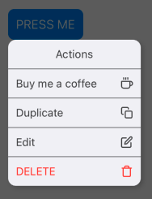
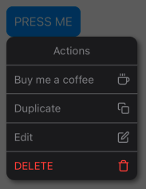

<h2 align="center">React Native Simple Pop Menu</h2>
<p align="center">The Customizable Pop Menu for <a href="https://facebook.github.io/react-native/">react native.</a>

<p align="center">
  <a href="https://www.npmjs.com/package/react-native-search-bar">
    
  </a>
  <a href="https://www.npmjs.com/package/react-native-simple-pop-menu">
    
  </a>
   <a href="https://prettier.io">
    
  </a>
</p>

Features:
* Simple to use popup/context menu
* Support all in and out [Animatable](https://github.com/oblador/react-native-animatable) animations
* Non opinionated and Extremely Customizable
* Auto position the menu based on the anchor position
* You provide your own item components
* You provide your own container component
* Fully typed with Typescript

| Light | Dark |
|---|---|
|||

## Installation

```
npm install react-native-simple-pop-menu --save
```
or
```
yarn add react-native-simple-pop-menu
```
## Usage
Wrap your application inside `PopMenuProvider` and then simply use `PopMenu` component where you need it.


```JSX
import {
  PopMenu,
  PopMenuItem,
  PopMenuProvider,
} from 'react-native-simple-pop-menu'

const menuItems1: PopMenuItem[] = [
  {
    render: () => <Text>Header</Text>,
  },
  {
    render: () => <Text>Item 1</Text>,
    onPress: () => console.log('item 1 pressed'), // Optional onPress
  },
  // ... more items
]

const App = () => {
  return (
      <PopMenuProvider>
        <View>
          <PopMenu items={menuItems1}>
            <Button>PRESS ME</Button>
          </PopMenu>
        </View>
      </PopMenuProvider>
  )
}

export default App
```

## Advanced Usage
Check the [example](https://github.com/alwex/react-native-pop-menu/blob/main/example/src/App.tsx) folder for more advanced usage

## Properties
 Prop                      | Description                                                                                                                                                                                                                                                                                                             | Default        |
| ------------------------- | ----------------------------------------------------------------------------------------------------------------------------------------------------------------------------------------------------------------------------------------------------------------------------------------------------------------------- | -------------- |
| **`items`**               | Array of `PopMenuItem` 
| **`container`**           | Menu Container (Optional)
| **`trigger`**             | Menu Open trigger `press` or `longPress` | `press`
| **`animationIn`**         | Opening Animation one of [Animatable](https://github.com/oblador/react-native-animatable) | `zoomIn`
| **`animationOut`**        | Closing Animation one of [Animatable](https://github.com/oblador/react-native-animatable) | `zoomOut`